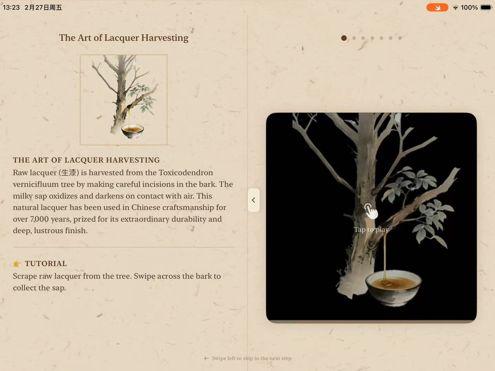
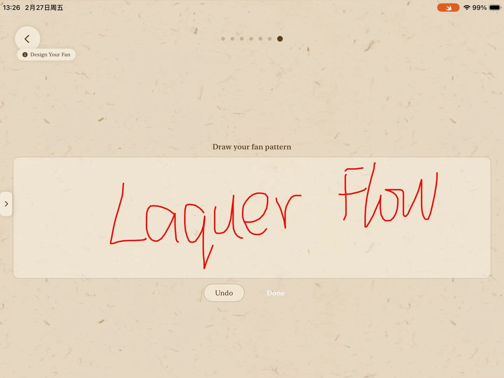
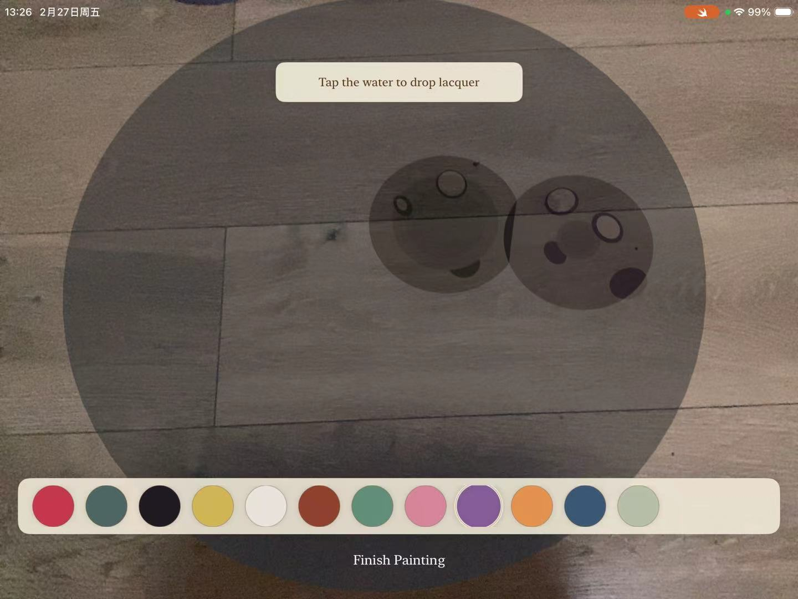
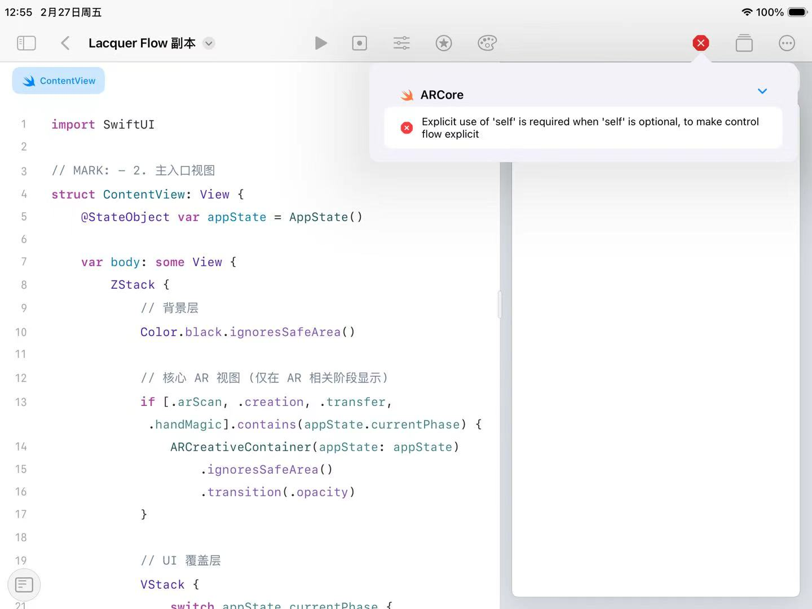
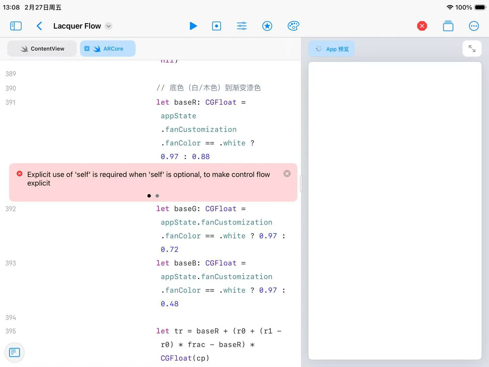

# Lacquer Flow · 漆扇流韵

<p align="center">
  
</p>

**Lacquer Flow** 是一款基于 AR 技术的中国漆扇非遗文化交互式体验应用。用户可以在 iPad / iPhone 上亲手体验漆扇制作全流程——从扇骨拼装、裱糊扇面、漆艺染色到手绘装饰，并通过 AR 将作品呈现在真实空间中。

> 让非遗走向世界，让世界爱上中国。

---

## 功能亮点

| 模块 | 说明 |
|------|------|
| 沉浸式教学 | 扇骨拼装、裱糊、漆艺染色、手绘装饰等分步引导 |
| 流体模拟 | 数字化漆液滴落与晕染，多色自然融合 |
| 个性化定制 | 折扇 / 团扇、扇柄风格、传统配色、题款文字 |
| AR 展示 | ARKit + RealityKit，手势控制扇子开合与移动 |
| 文化氛围 | 水墨风 UI、古典诗词、古筝背景音乐 |

<p align="center">
  
  &nbsp;&nbsp;
  
</p>

---

## 项目结构

本仓库包含两个可独立运行的版本：

```
LacquerFlow/
├── Lacquer Flow.swiftpm/     # 主版本：Swift Playgrounds App（含完整 AR 体验）
│   ├── Package.swift
│   ├── MyApp.swift
│   ├── ContentView.swift
│   ├── ARCore.swift / ARViews.swift
│   ├── TutorialView.swift / CustomizationViews.swift
│   └── Resources/            # 图片、视频、音频等资源
│
├── demo/                     # Xcode 工程版本（2D 交互流程原型）
│   ├── demo.xcodeproj
│   └── demo/
│       ├── ContentView.swift
│       ├── Views/            # 各关卡视图
│       ├── Managers/         # 音频、渲染、手势等管理器
│       └── Models/           # 数据模型
│
├── 作品介绍文书.md            # 项目说明与申报文档
└── README.md
```

| 版本 | 打开方式 | 推荐场景 |
|------|----------|----------|
| **Lacquer Flow.swiftpm** | Swift Playgrounds（iPad）或 Xcode 中打开 `.swiftpm` | 完整 AR + 手势交互体验 |
| **demo** | Xcode 打开 `demo/demo.xcodeproj` | 2D 关卡流程开发与调试 |

---

## 技术栈

- **语言**：Swift 6
- **UI**：SwiftUI
- **AR**：ARKit、RealityKit、Vision（手势追踪）
- **多媒体**：AVFoundation、Core Animation
- **图形**：Metal、Core Graphics、Canvas
- **最低系统**：iOS 16.0+
- **设备**：iPad / iPhone（横屏体验）

---

## 快速开始

### 方式一：Swift Playgrounds（推荐）

1. 将 `Lacquer Flow.swiftpm` 文件夹拷贝到 iPad 的 Swift Playgrounds
2. 在 Swift Playgrounds 中打开项目
3. 允许相机权限（AR 功能需要）
4. 横屏运行，按引导完成体验

### 方式二：Xcode

```bash
# 打开 Swift Playgrounds 包
open "Lacquer Flow.swiftpm"

# 或打开 demo 工程
open demo/demo.xcodeproj
```

1. 在 Xcode 中选择你的 **Development Team**（`Package.swift` / `project.pbxproj` 中的 Team ID 需替换为你自己的）
2. 连接真机（AR 与相机功能需真机调试）
3. 选择目标设备，点击 Run

---

## 体验流程

```
序章动画 → 教程引导 → 扇子定制 → AR 扫描 → 创作控制 → 转印 → 手势魔法 → 尾声展示
```

**demo 版本**采用两幕式关卡结构：

- **第一幕**：漆料采集 → 扇骨拼装 → 扇面装饰
- **第二幕**：上漆 → 染色 → 成品展示

---

## 截图

<p align="center">
  
  
  
</p>

---

## 许可证

本项目仅供学习与文化传播用途。背景音乐、3D 模型等资源请遵守相应版权规定，商用前请自行确认授权。

---

## 作者

GitHub: [@yinyueQvQ](https://github.com/yinyueQvQ)

---

<p align="center"><i>Lacquer Flow — Traditional Lacquer Fan Craft, Reimagined in AR</i></p>
